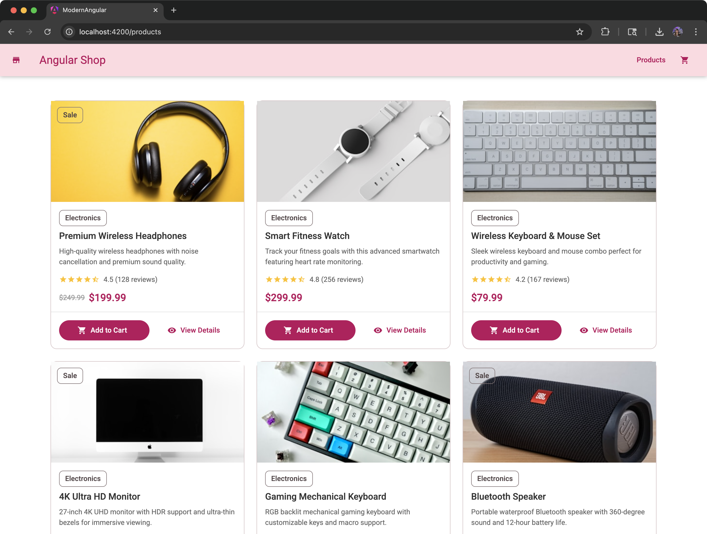
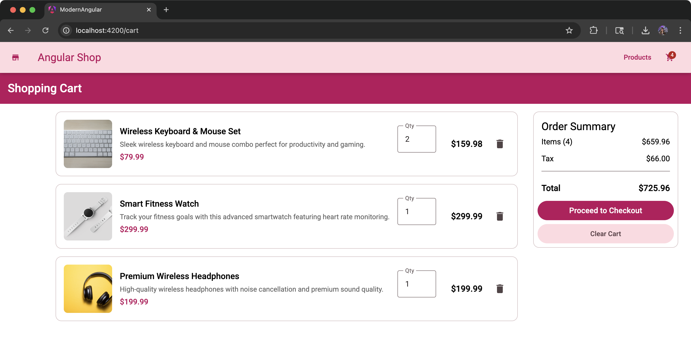

# Modern Angular Shop 🚀🛒


<!-- COVERAGE-START -->
<!-- Coverage badge and summary will be inserted here by CI -->
<!-- COVERAGE-END -->

A modern Angular sample project showcasing the latest features and best practices, built as an interactive coffee shop application.

## 🎯 Featured Angular Technologies

- **Angular v20** (Release Candidate) - Latest Angular features
- **Standalone Components** (v14+) - No NgModule dependencies
- **Angular Signals** (v16+) - Modern reactive primitives
- **New Control Flow** (v17+) - @if, @for, @switch syntax
- **Modern inject()** function - Dependency injection
- **Angular Material** - UI component library
- **Jest Testing** - Modern testing framework

## 🛠️ Development Tools & Extensions

### Recommended IDE Setup
- **Visual Studio Code** - Primary development environment
- **Angular Language Service** - Essential for Angular development
- **Angular Essentials Extension Pack** by Loiane - [Install here](https://marketplace.visualstudio.com/items?itemName=loiane.angular-extension-pack)

### Key Extensions Included:
- Angular Language Service
- Angular Snippets
- TypeScript Hero
- GitLens
- Prettier
- ESLint
- Material Icon Theme

## 📚 Learning Resources

This project includes comprehensive documentation in the `/docs` folder:

- **[Standalone Components Migration](./docs/Standalone-migration.md)** - Complete migration guide
- **[Angular Signals Guide](./docs/signals.md)** - Modern reactive programming
- **[Control Flow Syntax](./docs/control-flow.md)** - New @if, @for syntax
- **[Cart Implementation](./docs/cart-implementation.md)** - State management patterns
- **[Jest Migration](./docs/JEST_MIGRATION.md)** - Testing framework migration

## 🧪 Testing Strategy

The project uses **Jest** instead of Karma for faster test execution:

- **Unit Tests**: Component and service testing
- **Coverage Reports**: Available in `/coverage` directory
- **CI/CD Integration**: GitHub Actions automated testing
- **Test-Driven Development**: Comprehensive test suites

### Test Coverage
Current test coverage includes:
- ✅ All services (Cart, Products, Form Utils)
- ✅ All components (Cart, Products, Shared)
- ✅ Route configuration
- ✅ Application bootstrap

## 🔧 Technical Details

### Zoneless Change Detection (Angular v20)

This project runs Angular in **zoneless mode** using the built-in `provideZonelessChangeDetection()` API.

Benefits:
- ⚡ Fewer unnecessary change detection cycles
- 🧪 Faster and more predictable unit tests (no async Zone stabilization overhead)
- 🧼 Smaller runtime surface (Zone.js removed)

Implementation details:
- `provideZonelessChangeDetection()` is configured in `app.config.ts`.
- `zone.js` dependency has been removed from `package.json`.
- Jest test environment uses `setupZonelessTestEnv()` from `jest-preset-angular` (see `setup-jest.ts`).

If you need to temporarily re-enable Zone.js (e.g. for a library that still relies on it), reinstall `zone.js` and switch the test setup back to `setupZoneTestEnv()`.


### Project Structure
```
src/
├── app/
│   ├── cart/              # Shopping cart feature
│   ├── products/          # Product catalog feature
│   ├── components/        # Shared components
│   ├── app.routes.ts      # Route configuration
│   └── app.component.ts   # Root component
├── public/                # Static assets
└── styles.scss            # Global styles
```

### Modern Angular Patterns Used

1. **Standalone Components**: No NgModule dependencies
   ```typescript
   @Component({
     standalone: true,
     imports: [CommonModule, MatButtonModule],
     // ...
   })
   ```

2. **Signal-based State Management**:
   ```typescript
   cartItems = signal<CartItem[]>([]);
   cartCount = computed(() => this.cartItems().length);
   ```

3. **Modern Dependency Injection**:
   ```typescript
   private cartService = inject(CartService);
   private router = inject(Router);
   ```

## 🚀 Deployment

The project includes GitHub Actions for:
- ✅ **Continuous Integration** - Automated testing
- ✅ **Build Verification** - Ensure production builds work
- ✅ **Dependency Updates** - Automated dependency management

### Production Build
```bash
npm run build
# Outputs to dist/ directory
```

## 🤝 Contributing

This is a demonstration project showcasing modern Angular features. Feel free to:

1. Fork the repository
2. Create a feature branch
3. Make your changes
4. Add/update tests
5. Submit a pull request

## 📄 License

This project is licensed under the MIT License - see the [LICENSE](LICENSE) file for details.

## 👩‍💻 Author

**Loiane Groner**
- GitHub: [@loiane](https://github.com/loiane)
- Website: [loiane.com](https://loiane.com)
- Angular Extension Pack: [VS Code Marketplace](https://marketplace.visualstudio.com/items?itemName=loiane.angular-extension-pack)

---

⭐ **Star this repository if you found it helpful!** ⭐

## 📸 Application Screenshots

### Products List Page
Modern product listing with Material Design components and shopping cart integration:

<p align="center">
  
</p>

### Shopping Cart Page
Interactive cart with quantity management and total calculations:

<p align="center">
  
</p>

## 🏗️ Project Architecture

This application demonstrates modern Angular architecture patterns:

- **Feature-based structure** with lazy-loaded routes
- **Standalone components** eliminating NgModule complexity
- **Signal-based state management** for cart functionality
- **Reactive forms** with typed validators
- **Service-based architecture** with dependency injection
- **Material Design** for consistent UI/UX

### Key Features Implemented

- 🛍️ **Product Catalog** - Browse coffee products with filtering
- 🛒 **Shopping Cart** - Add/remove items with real-time updates
- 📱 **Responsive Design** - Mobile-first Material Design
- 🧪 **Comprehensive Testing** - Jest unit tests with coverage

## 🚀 Quick Start Guide

### Prerequisites

- **Node.js 22+** - [Download here](https://nodejs.org/)
- **npm** (comes with Node.js)
- **Git** (optional, for cloning)

### Installation & Running

1. **Install dependencies:**
   ```bash
   npm install
   ```

2. **Start the development server:**
   ```bash
   npm run start
   ```
   
   The application will automatically open at **http://localhost:4200**

3. **Run tests:**
   ```bash
   npm run test           # Run all tests
   npm run test:watch     # Watch mode
   npm run test:coverage  # Generate coverage report
   ```

4. **Build for production:**
   ```bash
   npm run build
   ```

### Available NPM Scripts

| Command | Description |
|---------|-------------|
| `npm run start` | Start dev server with auto-reload |
| `npm run build` | Production build |
| `npm run test` | Run Jest tests once |
| `npm run test:watch` | Run tests in watch mode |
| `npm run test:coverage` | Generate test coverage report |
| `npm run watch` | Build in watch mode |
