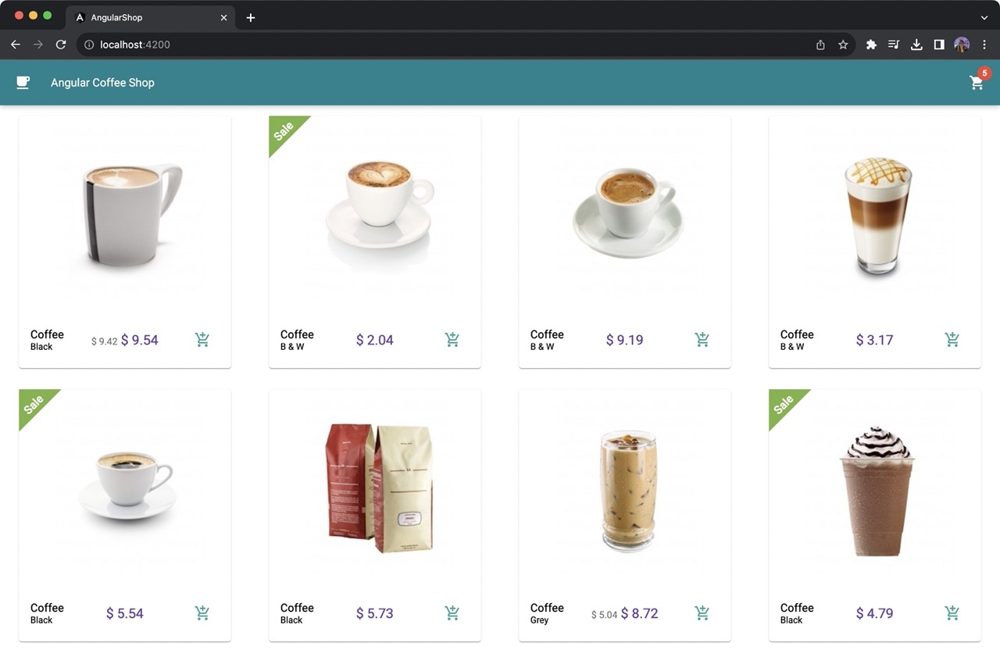
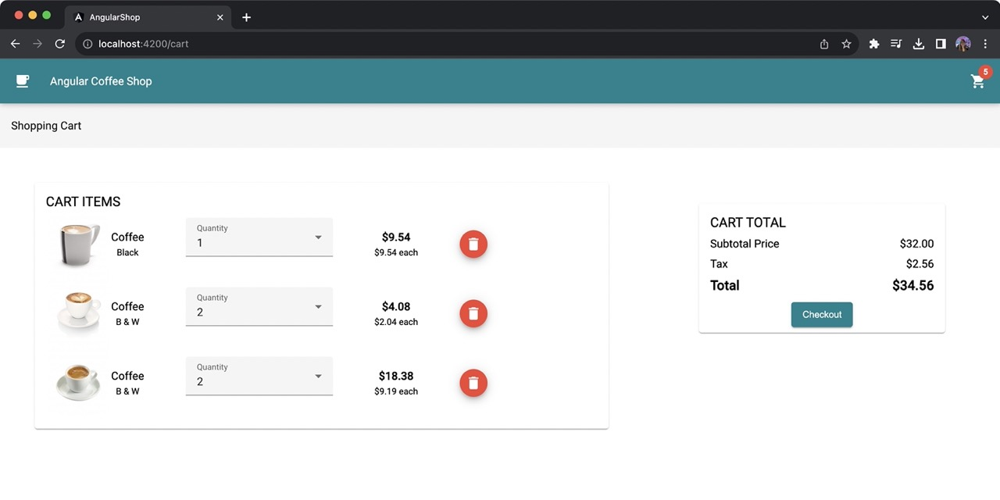

# Angular Shop


Sample project created to showcase the latest and modern Angular features:

- Standalone Components and API (Angular v14 and v15)
- Typed Forms (Angular v14)
- Signals (Angular v16)
- Input Validation (Angular v16)
- New Control Flow (Angular v17)

## Branches

- [classic](https://github.com/loiane/angular-shop/tree/classic): code with ngModules and RxJS for computed properties
- [main](https://github.com/loiane/angular-shop/tree/main): latest code with all features mentioned above
- [standalone-components](https://github.com/loiane/angular-shop/tree/standalone-components): standalone components and types forms
- [signals](https://github.com/loiane/angular-shop/tree/signals): standalone + signals

## ⌨️ Editor / IDE

- Visual Studio Code
- Angular Extensions [link](https://marketplace.visualstudio.com/items?itemName=loiane.angular-extension-pack)

## Screenshots

Main page with products list:

<p align="center">
  
</p>

Cart page:

<p align="center">
  
</p>

## Executing the code locally

You need to have Node.js / NPM installed locally.

1. Install all the required dependencies:

```
npm install
```

2. Execute the project:

```
npm run start
```

This command will run the Angular project with a proxy to the Java server, without requiring CORS.

Open your browser and access **http://localhost:4200** (Angular default port).
